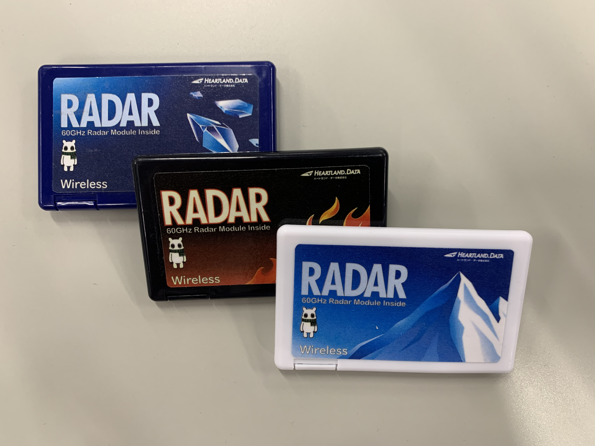
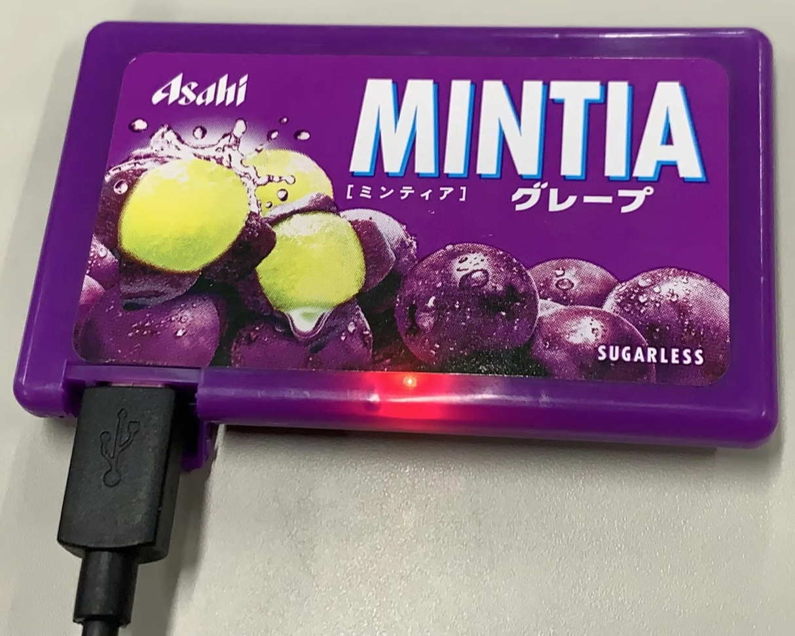
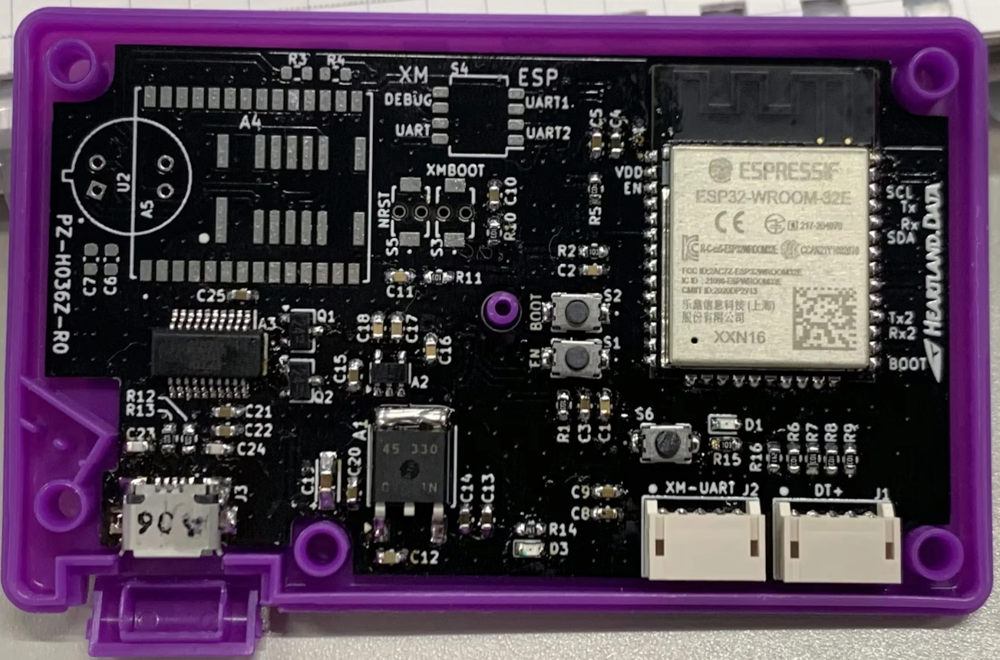

# esp32-mintia-sensor-kit

本リポジトリは、MINTIAケースにESP32と各種センサを組み込む試作用ファームウェアの参考実装です。

Acconeer XM125（存在検知レーダー）、AMG8833（8×8 IRアレイ）、MLX90640（32×24 IRアレイ）の3種のセンサを制御し、計測データをBluetooth Classic (SPP) および UART でホストPCへ送信します。

MINTIAケース

MINTIAケースに基板を組み込んだ状態の外観です。

ケース上部を開けると、内部の基板を確認できます。

ハードウェア構成、基板設計、部品実装などの詳細については、以下の解説記事を参照してください。

- [MINTIA(清涼菓子) へ ESP32 を組込む ~ 準備編 ~ - Qiita](https://qiita.com/TTL/items/94461dc0f962da8d8ca6)
- [MINTIA(清涼菓子) へ ESP32 を組込む ～ 回路、基板設計 ～ - Qiita](https://qiita.com/TTL/items/4987077ce9cf24eee11f)
- [MINTIA(清涼菓子) へ ESP32 を組込む ～ガーバー出力 ～ - Qiita](https://qiita.com/TTL/items/95624cc8908f53563718)
- [MINTIA(清涼菓子) へ ESP32 を組込む ～基板発注～ - Qiita](https://qiita.com/TTL/items/4f62d206479876ff367e)
- [MINTIA(清涼菓子) へ ESP32 を組込む ～基板到着 -> 部品実装～ - Qiita](https://qiita.com/TTL/items/9614f3e603545a89d696)

## 対応センサ

| センサ            | 種別             | 解像度 / 検知方式                 |
| ----------------- | ---------------- | --------------------------------- |
| Acconeer XM125    | レーダーセンサー | I2C 接続、距離・存在検知          |
| AMG8833 (AMG88xx) | IRセンサー       | I2C 接続、8×8 ピクセル            |
| MLX90640          | IRセンサー       | I2C 接続、32×24 ピクセル（768点） |

## ビルド環境

| 項目           | バージョン                                      |
| -------------- | ----------------------------------------------- |
| ESP-IDF        | v5.4.1                                          |
| ビルドシステム | CMake + idf.py                                  |
| Bluetooth      | Classic (SPP) — `sdkconfig.defaults` で設定済み |
